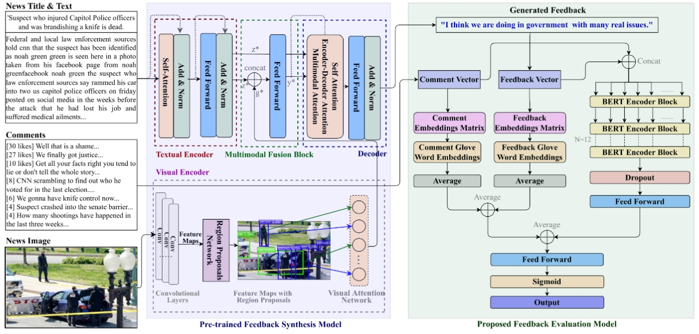

Automatic Evaluation of Machine Generated Feedback For Text and Image Data
============================================================================================

Implementation for the paper submitted to The 5th IEEE International Conference on Multimedia Information Processing and Retrieval (MIPR 2022) MCAUIS Workshop. <br>
**[Automatic Evaluation of Machine Generated Feedback For Text and Image Data][1]**<br>
Pratham Goyal*, Anjali Raj*, [Puneet Kumar](https://puneet-kr.github.io/), and [Balasubramanian Raman](http://faculty.iitr.ac.in/~balarfma/)  

<!---->


Setup and Dependencies
----------------------
1. Install Anaconda or Miniconda distribution and create a conda environment with **Python 3.6+**.
2. Install the requirements using the following command:
```sh
pip install -r Requirements.txt
```
3. Download [glove.6B.zip][2], unzip and keep in `glove.6B` folder.
4. Download the required datasets.

[BERT](WWW.ABC.COM)
Steps to run the Code
---------------------
...

Dataset Access
--------------
Access to the ‘IIT Roorkee Multimodal Feedback Synthesis (IIT-R MMFeed) dataset’ can be obtained by through [`Access Form - IIT-R MMFeed Dataset.pdf`][2]. The dataset is prepared at Machine Intelligence Lab, IIT Roorkee under the supervision of Prof. Balasubramanian Raman. It consists of 9,479 samples containing news text, images, user comments, and the number of likes for each comment.

[1]:https://mcauis2022.github.io/  
[2]:https://github.com/MIntelligence-Group/MMFeed/blob/main/Access%20Form%20-%20IIT-R%20MMFeed%20Dataset.pdf
[3]:WWW.ABC.COM
